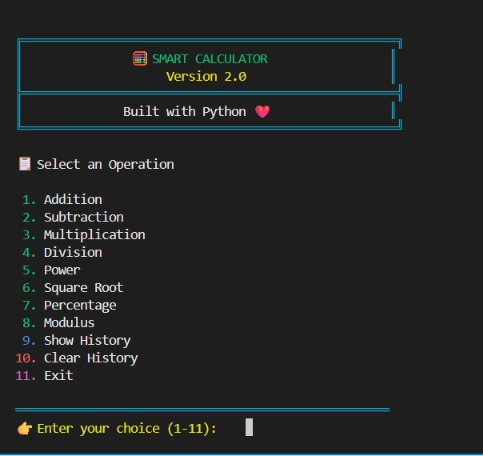
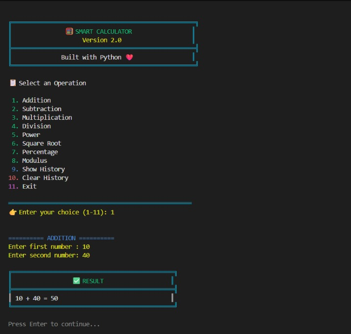
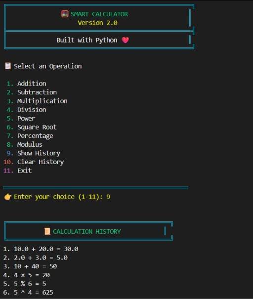

# 🧮 Smart Calculator

A modern command-line calculator built with **Python**. It performs common mathematical operations with a colorful terminal interface, maintains calculation history, and includes input validation for a smooth user experience.


---

## ✨ Features

- ➕ Addition
- ➖ Subtraction
- ✖️ Multiplication
- ➗ Division
- ⚡ Power
- √ Square Root
- 📊 Percentage Calculator
- % Modulus
- 📜 Calculation History
- 🗑️ Clear History
- 💾 Automatic History Saving
- 🎨 Colorful Terminal Interface
- 🛡️ Exception Handling
- ✅ Input Validation

---

## 🛠️ Technologies Used

- Python 3
- Colorama

---

## 📂 Project Structure

```text
smart-calculator-python/
│
├── modules/
│   ├── __init__.py
│   └── calculator.py
│
├── screenshots/
│
├── .gitignore
├── LICENSE
├── README.md
├── history.txt
├── main.py
└── requirements.txt
```

---

## 🚀 Installation

### 1. Clone the repository

```bash
git clone https://github.com/amanawasthi-lang/smart-calculator-python.git
```

### 2. Open the project

```bash
cd smart-calculator-python
```

### 3. Install dependencies

```bash
pip install -r requirements.txt
```

### 4. Run the project

```bash
python main.py
```

---

## 💻 Menu

```text
1. Addition
2. Subtraction
3. Multiplication
4. Division
5. Power
6. Square Root
7. Percentage
8. Modulus
9. Show History
10. Clear History
11. Exit
```

---

## 📸 Screenshots

### Home Screen




### Result




### History



---

## 📚 What I Learned

This project helped me practice:

- Python Functions
- Python Modules
- File Handling
- Exception Handling
- Lists
- User Input Validation
- Terminal UI using Colorama
- Writing clean and reusable Python code

---

## 🔮 Future Improvements

- Scientific Calculator Mode
- Export History to CSV
- Graphical User Interface (GUI)
- Unit Converter

---

## 👨‍💻 Author

**Aman Awasthi**

GitHub: https://github.com/amanawasthi-lang

---

## 📄 License

This project is licensed under the **MIT License**.